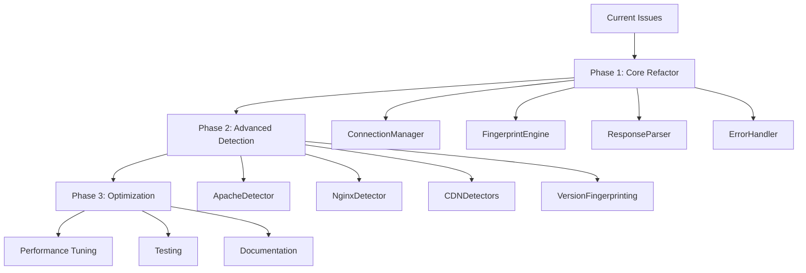

# Banner Grabber Implementation Plan

## Current State Analysis

Based on test results, the banner grabber has several critical issues:

1. **Version Detection**: Apache servers return "Apache" without version
2. **Server Header Stripping**: CDNs/WAFs remove Server headers entirely
3. **Timeout Handling**: FTP/SSH services timeout on some targets
4. **Error Response Processing**: 503 responses provide no useful banner data
5. **Incomplete Fingerprinting**: Missing advanced server identification

## Implementation Roadmap



## Phase 1: Core Architecture Refactor

### 1.1 ConnectionManager Implementation

**Objective**: Handle connection retries, timeouts, and socket management

**Key Features**:
- Exponential backoff retry logic
- Configurable timeout management
- Connection pooling for efficiency
- SSL context reuse

**Code Structure**:
```python
class ConnectionManager:
    def __init__(self, max_retries=3, base_timeout=5.0, backoff_factor=2.0):
        self.max_retries = max_retries
        self.base_timeout = base_timeout
        self.backoff_factor = backoff_factor

    def create_connection(self, target, port, use_ssl=False):
        # Implementation with retry logic

    def send_request(self, sock, request, timeout=None):
        # Send with timeout and error handling
```

### 1.2 FingerprintEngine Creation

**Objective**: Multi-stage server detection pipeline

**Detection Stages**:
1. **Primary**: Standard header analysis
2. **Secondary**: Advanced fingerprinting
3. **Tertiary**: Behavioral analysis

**Code Structure**:
```python
class FingerprintEngine:
    def __init__(self):
        self.detectors = {
            'apache': ApacheDetector(),
            'nginx': NginxDetector(),
            'cdn': CDNDetector()
        }

    def identify_server(self, response, target, port):
        # Multi-stage detection logic
```

### 1.3 ResponseParser Enhancement

**Objective**: Advanced response parsing and analysis

**Improvements**:
- Header normalization
- Body content analysis
- Error page detection
- Security header identification

### 1.4 ErrorHandler Implementation

**Objective**: Comprehensive error handling and recovery

**Features**:
- Error categorization
- Recovery strategies
- Partial result handling
- Debug information collection

## Phase 2: Advanced Detection Implementation

### 2.1 ApacheDetector Module

**Detection Techniques**:
- Error page fingerprinting (404/500 pages)
- .htaccess behavior analysis
- Module-specific headers
- Configuration leak detection

**Version Detection**:
```python
def detect_apache_version(self, response):
    # Check error pages for version
    # Analyze module headers
    # Try configuration leaks
```

### 2.2 NginxDetector Module

**Detection Techniques**:
- Default error page recognition
- Header pattern analysis
- Configuration fingerprinting
- Upstream header detection

### 2.3 CDN/WAF Detectors

**Supported Systems**:
- Cloudflare
- Incapsula/Imperva
- Akamai
- Fastly
- Sucuri

**Detection Methods**:
- Header analysis
- Cookie patterns
- Response behavior
- JavaScript fingerprints

### 2.4 Version Fingerprinting Engine

**Techniques**:
- Error page analysis
- Header leak detection
- Behavioral fingerprinting
- Known vulnerability patterns

## Phase 3: Optimization and Testing

### 3.1 Performance Optimization

**Improvements**:
- Connection reuse
- Parallel processing optimization
- Memory usage reduction
- Caching mechanisms

### 3.2 Comprehensive Testing

**Test Categories**:
- Unit tests for each detector
- Integration tests for full pipeline
- Performance benchmarks
- Real-world target testing

### 3.3 Documentation and Maintenance

**Deliverables**:
- API documentation
- Usage examples
- Troubleshooting guide
- Fingerprint database format

## Detailed Implementation Steps

### Step 1: Core Refactor (Week 1)

1. **Create ConnectionManager**
   - Implement retry logic
   - Add timeout handling
   - Test connection pooling

2. **Build FingerprintEngine skeleton**
   - Define detector interface
   - Implement pipeline logic
   - Add basic detection

3. **Enhance ResponseParser**
   - Improve header parsing
   - Add body analysis
   - Implement normalization

### Step 2: Detector Implementation (Week 2)

1. **ApacheDetector**
   - Implement error page analysis
   - Add module detection
   - Test version extraction

2. **NginxDetector**
   - Default page recognition
   - Header pattern matching
   - Configuration analysis

3. **CDN Detectors**
   - Header-based detection
   - Behavioral analysis
   - Confidence scoring

### Step 3: Advanced Features (Week 3)

1. **Version Fingerprinting**
   - Error page parsing
   - Header leak detection
   - Pattern matching

2. **Error Handling**
   - Recovery mechanisms
   - Partial results
   - Debug logging

3. **Performance Tuning**
   - Memory optimization
   - Connection reuse
   - Parallel processing

### Step 4: Testing and Validation (Week 4)

1. **Unit Testing**
   - Each detector module
   - Connection management
   - Error scenarios

2. **Integration Testing**
   - Full pipeline testing
   - Multi-target scanning
   - Various server types

3. **Real-World Validation**
   - Known server farms
   - CDN-protected sites
   - Different hosting providers

## Success Criteria

### Functional Goals
- [ ] Detect Apache versions with >80% accuracy
- [ ] Identify CDN/WAF with >90% accuracy
- [ ] Handle timeouts gracefully
- [ ] Extract info from error responses
- [ ] Support 10+ server types

### Performance Goals
- [ ] <5% false positive rate
- [ ] <10 second average scan time
- [ ] Handle 1000+ concurrent targets
- [ ] <200MB memory usage

### Quality Goals
- [ ] >95% test coverage
- [ ] <5 critical bugs
- [ ] Full backward compatibility
- [ ] Comprehensive documentation

## Risk Assessment and Mitigation

### Technical Risks
1. **Detection Evasion**
   - *Risk*: Servers change fingerprints
   - *Mitigation*: Regular database updates, confidence scoring

2. **Performance Degradation**
   - *Risk*: Advanced detection slows scanning
   - *Mitigation*: Configurable detection levels, caching

3. **False Positives**
   - *Risk*: Incorrect identifications
   - *Mitigation*: Multi-factor verification, user confirmation

### Operational Risks
1. **Resource Usage**
   - *Risk*: High memory/CPU consumption
   - *Mitigation*: Resource monitoring, configurable limits

2. **Breaking Changes**
   - *Risk*: Incompatible API changes
   - *Mitigation*: Version compatibility, migration guides

## Monitoring and Metrics

### Key Metrics
- Detection accuracy by server type
- Scan performance (time/target)
- Error rates and types
- Resource usage statistics

### Alerting
- Accuracy drops below threshold
- Performance degradation
- High error rates
- Resource usage spikes

## Deployment Strategy

### Phased Rollout
1. **Alpha**: Core refactor (internal testing)
2. **Beta**: Advanced features (limited users)
3. **GA**: Full release (all users)

### Rollback Plan
- Feature flags for new functionality
- Version compatibility
- Database backup and recovery

## Maintenance Plan

### Ongoing Tasks
- Fingerprint database updates
- Detector accuracy monitoring
- Performance optimization
- Security vulnerability patching

### Community Integration
- Open-source contribution guidelines
- Issue tracking and triage
- Feature request management
- Documentation updates